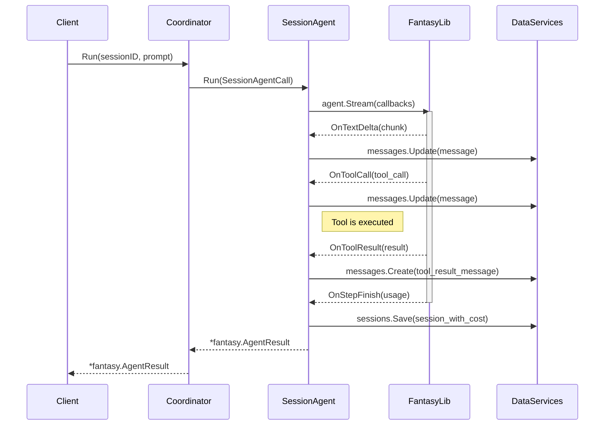

# Development Roadmap

## Design Principles & Coding Standards

> **Reference:** All design principles, coding standards, and implementation guidelines are defined in [
> `.cursor/rules/rules.mdc`](../.cursor/rules/rules.mdc).

### How To Apply These Rules

Automatically loads rules from the `.cursor/rules/` directory. The `rules.mdc` file includes `alwaysApply: true` in its
frontmatter, which ensures:

- **Automatic Application:** Rules are always active during coding sessions
- **Context Awareness:** Understands project-specific patterns (Vim navigation, TUI-first UX, Go conventions)
- **Consistency:** All code suggestions follow the defined principles without manual reminders

## Bug Fix Protocol

1. **Global Fix:** Search codebase (`rg`/`fd`) for similar patterns/implementations. Fix **all** occurrences, not just
   the reported one.
2. **Documentation:**

- Update "Known Bugs" table (Status: Fixed).
- Update coding standards in `.cursor/rules/rules.mdc` if the bug reflects a common anti-pattern.

3. **Testing:** Verify edge cases: Interactive, Piped (`|`), Redirected (`<`), and Non-interactive modes.

> **Reference:** Bug Fix Protocol are defined in [`.cursor/rules/rules.mdc`](../.cursor/rules/rules.mdc).

# v0.1 - MVP Release 

**Status:** Completed ✅

**Features Implemented:**

- [x] Cobra CLI framework with `root` and `review` commands
- [x] Git diff extraction (`git diff` and `git diff --staged`)
- [x] File-scope context: reads full content of modified files
- [x] Gemini API client with streaming response support
- [x] Interactive TUI with Bubbletea
  - [x] State machine (Loading → Reviewing → Chatting)
  - [x] Markdown rendering with Glamour
  - [x] Follow-up chat mode
  - [x] Keyboard shortcuts (q: quit, Enter: chat, Esc: back)
- [x] Senior Go Engineer persona prompt
- [x] File filtering (vendor/, generated, tests, go.sum)
- [x] Secret detection (API keys, tokens, passwords, private keys)
- [x] Command flags: `--staged`, `--model`, `--force`, `--no-interactive`
- [x] Non-interactive mode for CI/scripts

---

# v0.2 - Enhanced Diff & Context 

**Status:** Completed ✅

**Features Implemented:**

- [x] **Custom base branch/commit comparison**
  - `--base <branch>` - Compare against a branch (e.g., `main`, `develop`)
  - `--base <commit>` - Compare against a specific commit hash
  - MR-style diff using `git diff base...HEAD`
- [x] **Update default model** - Changed to `gemini-2.5-pro`
- [x] **Show context preview** - Display files/tokens being sent before review
  - File list with sizes
  - Total file count and size
  - Ignored files list
  - Token estimate
- [x] **Token usage display** - Show actual tokens used after review
  - Prompt tokens
  - Completion tokens
  - Total tokens

**Breaking Changes:**

- Default model changed: `gemini-2.5-flash` → `gemini-2.5-pro`

---

# v0.3.0 - Short Flags & Preset Management 

**Status:** Completed ✅

**Features Implemented:**

### Short Flag Aliases ✅

- [x] Short aliases for all flags (`-s`, `-b`, `-m`, `-f`, `-i`, `-I`, `-k`, `-p`)
- [x] Version flag (`--version`, `-v`)

### Vim-Style Keybindings ✅

- [x] Navigation: `j/k`, `g/G`, `Ctrl+d/u/f/b`
- [x] Search: `/`, `n/N`, `Tab` toggle
- [x] Help overlay: `?` key

### Yank to Clipboard ✅

- [x] `y` - Yank entire review + chat history
- [x] `Y` - Yank only last response
- [x] `yb` - Yank code block
- [x] Visual feedback (toast notification)

### Review Presets ✅

- [x] `--preset <name>` / `-p` flag
- [x] Built-in presets: `quick`, `strict`, `security`, `performance`, `logic`, `style`, `typo`, `naming`
- [x] Custom presets in `~/.config/revcli/presets/*.yaml`
- [x] Default preset support via config
- [x] Preset replace mode (`--preset-replace` / `-R`)

### Preset Management Commands ✅

- [x] `preset list` - List all presets
- [x] `preset create` - Create custom preset
- [x] `preset edit` - Edit custom preset (external editor)
- [x] `preset delete` - Delete custom preset
- [x] `preset show` - Show preset details
- [x] `preset open` - Open preset file/directory
- [x] `preset path` - Show preset path
- [x] `preset default` - Set/show default preset
- [x] `preset system` - Manage system prompt (`show/edit/reset`)

---

# v0.3.1 - TUI Refactor & Code Block Removal 

**Status:** Completed ✅

**Features:**

### TUI Refactoring

- [x] Replace `msg.String()` key comparisons with `key.Matches()` using centralized `KeyMap` structs
- [x] Decompose monolithic `Update` function into state-specific handlers (`updateKeyMsgReviewing`,
      `updateKeyMsgChatting`, etc.)
- [x] Decompose monolithic `View` function into state-specific renderers (`viewLoading`, `viewMain`, `viewError`)
- [x] Centralize yank chord state reset logic

### Code Block Feature Removal

- [x] Remove code block navigation (`[`, `]`) and `yb` yank functionality (deferred to v0.6)
- [x] Update all documentation to reflect removal
- [x] Add in-code comments explaining rationale for removal
- [x] `yy` now yanks entire review + chat history (no code-block navigation)
- [x] `Y` yanks only the last assistant response

### Documentation Updates

- [x] Update Coding Styles with TUI key-handling and feature-removal guidelines
- [x] Update help text and footer to remove code block references
- [x] Refactor `CalculateViewportHeight` to derive search/chat state from `State` enum instead of redundant boolean
      parameters
- [x] Add error logging for markdown rendering fallbacks to maintain visibility during development

---

# v0.3.2 - Context & Intent 

**Status**: Completed ✅

## Features

#### 🎯 Intent-Driven Review (New "Prompt First") ✅

- [x] **Pre-Review Form (`huh`):** Before scanning, ask:
  - Custom instruction (e.g., "Focus on error handling").
  - Select Focus Areas (Security, Performance, Logic, Style, Typo, Naming).
  - Negative constraints (what to ignore).
- [x] **Smart Context:** If the user asks for "Security," automatically inject the `security` preset rules into the
      system prompt.
- [x] **Intent Integration:** Intent collected via `ui.CollectIntent()` in `cmd/review.go`, passed to
      `Builder.WithIntent()`, merged into system prompt via `BuildSystemPromptWithIntent()`.

#### 🧠 Context Pruning (Dynamic Ignore) ✅

- [x] **"Summarize & Prune" Action:** In the TUI, pressing `i` in reviewing mode:
  1. Enters file list view (`StateFileList`) using `bubbles/list`.
  2. User selects file and presses `i` to prune.
  3. Uses Gemini Flash model (`gemini-2.5-flash`) to summarize the code file.
  4. Replaces the actual code in the context window with summary in subsequent prompts.
  5. **Benefit:** Saves massive tokens for the _next_ turn of chat while keeping the "map" of the code.
- [x] **File List Navigation:** Vim-style navigation (`j/k`) through files, visual indicator (✓) for pruned files.
- [x] **Pruning Integration:** `PrunedFiles` map in `ReviewContext`, used by `BuildReviewPromptWithPruning()` in prompt
      template.
- [x] **Negative Prompting:** Negative constraints collected in intent form, added to system prompt as "User explicitly stated to ignore: [constraints]".

#### Gemini New Provider

- [x] Migrating Gemini provider
- [x] Toggle Enable Web Search on each request as checkbox, can be changed in follow-ups questions as well (default = true)

### Implementation Details

**New Files:**

- `internal/ui/intent_form.go` - Pre-review form using `huh.NewForm`
- `internal/context/intent.go` - Intent struct and `BuildSystemPromptWithIntent()` helper
- `internal/ui/file_list.go` - File list component using `bubbles/list`
- `internal/ui/prune.go` - `PruneFile()` function using Gemini Flash for summarization
- `internal/ui/update_filelist.go` - File list state update handlers
- `internal/ui/prune.go` - Pruning action handlers

**Modified Files:**

- `cmd/review.go` - Collects intent before building context
- `cmd/review_helpers.go` - Integrates intent with builder via `WithIntent()`
- `internal/context/builder.go` - Added `Intent` field and `WithIntent()` method, `PrunedFiles` in `ReviewContext`
- `internal/prompt/template.go` - Added `BuildReviewPromptWithPruning()` to use summaries
- `internal/ui/model.go` - Added `StateFileList` state and `fileList` model
- `internal/ui/update_reviewing.go` - Added `i` keybinding to enter file list model
- `internal/ui/view_model.go` - Added `viewFileList()` renderer

### Issues Found

- [x] IS01: Cannot ask follow-ups questions --> can not type
- [x] IS02: Can not quit (`q`) after get streaming error
- [x] IS03: Need to detect/bypass `FinishReasonSafety`
- [x] IS04: Can not cancel streaming

Here is the updated **v0.4.0** plan with the completed SDK migration removed.

# v0.4.0 - Responsive control 

**Status:** Completed ✅

### 1. Interaction & Feedback ✅

- [x] **Async Pruning with Enhanced Feedback:** Implement `tea.Cmd` with file-specific spinner and non-blocking UI for other actions. Consider subtle progress for long operations.
  - Per-file spinners in file list (⏳ indicator when pruning)
  - Non-blocking: file list navigation works during pruning
  - Multiple files can be pruned simultaneously with individual spinners
  - Spinner state tracked in `pruningSpinners map[string]spinner.Model`
- [x] **Robust Cancellation (`Ctrl+X`):** Propagate `context.WithCancel` through all long-running operations; ensure immediate UI feedback and clean state on cancellation.
  - Ctrl+X works in all states (loading, file list, chatting, reviewing)
  - Cancels all active pruning operations
  - Immediate UI feedback with cancellation message
  - Clean state cleanup on cancellation
- [x] **Guided Intent Input:** Upgrade `huh` form for custom text intent with validation and dynamic suggestions/auto-completion for focus areas.
  - Custom instruction validation (minimum 10 chars if provided, or empty)
  - Improved field descriptions with examples
  - Placeholder text for negative constraints field
  - Better UX guidance in form descriptions

### 2. DevOps & CI/CD

- [ ] **Actionable Security Workflow:** Integrate OpenSSF Scorecard (`scorecard.yaml`) in CI; explore `revcli` consumption for in-terminal insights.
- [ ] **Secure Release Automation:** Configure GoReleaser (`.goreleaser.yaml`) for multi-platform builds, Homebrew tap, and integrate Cosign for artifact signing.
- [ ] **Fast & Comprehensive CI Pipeline:** Add `golangci-lint` (strict config) and `go test -race`; optimize for speed and provide local pre-commit targets.

# v0.4.1 - Code Quality Refactoring 

**Status:** Completed ✅

## Refactoring Completed

### File Size Optimization
- **Split `update.go`:** Reduced from 346 lines to 172 lines by extracting:
  - `update_stream.go` - Stream message handlers (`handleStreamMessages`, `handleSpinnerTick`)
  - `update_feedback.go` - Feedback message handlers (`handleYankMessages`, `handlePruneMessages`, `handleChatMessages`, `handleReviewMessages`)
  - `update.go` - Main dispatcher and common handlers remain

### Code Duplication Elimination
- **Consolidated file list functions:** Merged duplicated `*WithPruningState` variants:
  - `NewFileListModel` now accepts optional `pruningFiles` parameter (nil when not needed)
  - `UpdateFileListModel` now accepts optional `pruningFiles` parameter (nil when not needed)
  - Removed `NewFileListModelWithPruningState` and `UpdateFileListModelWithPruningState`
  - Updated all call sites (5 locations) to use consolidated functions

### Rules Updated
- Added anti-pattern guidance: Prefer optional parameters over "With*" function variants to avoid duplication

## v0.5.0 - Agent Architecture 

**Status:** Completed ✅

**Features Implemented:**

- [x] **Coordinator Architecture:** Refactored to use Coordinator architecture to manage agent flow
  - [x] Implemented `Coordinator` interface and struct
  - [x] Integrated with Fantasy library for agent streaming
  - [x] Session management with agent execution
  - [x] Tool execution and callback handling

**Known Issues:**

- [x] Fix: infinite loading: ⢿  Analyzing your code changes... (spinner stuck during review)

## Coordinator Architecture

# v0.6.0 - Review Tool Implementation 

**Status:** Completed ✅

**Overview:** Implemented code review tool functionality, establishing foundation for future multi-mode support (review, build, ask).

## Priority 1: Critical Changes ✅

- [x] Implemented `AgentReviewer` agent for code review workflows
- [x] Created `reviewer.md.tpl` template with review-focused workflows
- [x] Updated `prompts.go` to use `reviewerPrompt` function
- [x] Updated `coordinator.go` to use `AgentReviewer` constant
- [x] Updated `task.md.tpl` for review context

## Priority 2: Important Updates ✅

- [x] Updated `title.md` to mention review requests
- [x] Updated `summary.md` with review-specific sections (Current State, Files & Changes, Review Context)
- [x] Implemented `InitReviewerAgent` in `app.go` and `chat.go`
- [x] Updated error messages to use "reviewer agent" terminology
- [x] Updated templates and config to use revCLI branding
- [x] Updated JSON schema descriptions in `config.go` to use revCLI branding

## Priority 3: Future Mode Foundation ✅

- [x] Added TODO comments throughout codebase for future mode system (Plan v0.6-C)
- [x] Documented tool filtering strategy in `config.go` before `SetupAgents()`
- [x] Marked `coder.md.tpl` and `coderPrompt` for future build mode

**Note:** Plan v0.6-C (Review-Native Redesign) deferred to future release. Current implementation establishes foundation while keeping codebase functional.

---

# v0.6.1 - Config Providers

**Status:** Planned

**Features:**

### TUI: Config
- [ ] Handle create config on first use
- [ ] Interactive config setup flow

### Command: Config
- [ ] `config` command to manually change default settings
- [ ] `config`: handle refactor func `LoadConfig`
- [ ] Support for multiple config providers/sources

# v0.7.0 - Functional Calling

**Status:** Planned

**Features:**

### Tools & Templates
- [ ] Write tools & templates:
  - [ ] Review changes
  - [ ] Read file
  - [ ] Prune context
- [ ] Tool execution UI feedback
- [ ] Tool result visualization

# v0.8.0 - TUI Enhance

**Status:** Planned

**Features:**

### Tool Execution Visibility
- [ ] Show tool results (what tools it uses) while loading
- [ ] Real-time tool call indicators
- [ ] Tool execution progress display

---

# v0.9.0 - Structured Intelligence 

**Status:** Planned

### Core features

#### 1. Core Logic & Data Structure (Prerequisite)

- [ ] **Define Schema:** Implement `ReviewIssue` struct and map it to **OpenAPI 3.0** schema.
- [ ] **Tool Configuration:** Configure `submit_review` tool to force **deterministic** JSON output.
- [ ] **JSON Unmarshaling:** Implement logic to bridge `map[string]interface{}` responses back to strict Go structs.
- [ ] **Safe Fallback:** Handle cases where the model refuses to call the function (fallback to text).

#### 2. TUI & Visualization (UX Focused)

- [ ] **List View:** Replace Markdown viewport with `bubbles/list` for navigable issue tracking.
- [ ] **Custom Delegate:** Implement `lipgloss` rendering for colored Severity pills and Category tags.
- [ ] **Detail State:** Create `StateDetailView` (Enter key) to render full suggestion/context using Glamour.
- [ ] **Token Transparency:** Extract `UsageMetadata` from JSON response; display "Tokens In/Out & Cost" in list footer.

### Planned features

#### Go AST Integration

- [ ] **Symbolic Mapping:** Map `git diff` hunks to `ast.Node` boundaries (FuncDecl, TypeDecl) using `go/parser`.
- [ ] **Context Hoisting:** Automatically inject full parent `struct` and `interface` definitions into prompts when methods are modified to prevent type hallucinations.
- [ ] **Signature Extraction:** Feed exact function signatures and field types into the LLM to ensure suggestions respect existing API contracts.
- [ ] **Semantic Impact:** Use `go/types` for cross-package dependency analysis to detect downstream breaking changes.
- [ ] **AST-Based Patching:** Transition from `diff` patches to `github.com/dave/dst` for format-preserving, type-safe code generation.
- [ ] **Pre-flight Validation:** Run `parser.ParseSource` on LLM suggestions to verify syntactical correctness before displaying in TUI.

#### Smart Read
- Add mode to read codebase and adapt styles

#### Context Intelligence

- [ ] **Dependency Graph:** Implement Regex-based import scanning to find "Related Context" (files that import the changed code).
- [ ] **Smart Pruning:** Feed "Related Context" summaries into the prompt to detect breaking changes in other files.

#### Refactoring

- [ ] **`samber/lo` Integration:** Refactor slice logic in `diff` and `review` packages using declarative pipelines (Filter, Map).
- [ ] **Ignore Management:** Implement `.revignore` support (using `samber/lo` to filter).

# v0.x - Panes & Export 

**Status:** Planned

**Features:**

### The "Lazy" Experience (UX)

- [ ] **Interactive Patching:** `Apply` button that actually writes code.
- [ ] **Panes:** Reviews | Chat | Config (Tab to switch).

### Setting Management

- [ ] Can change default setting (new subcommand)

### Panes Management Mode

- [ ] Multi-pane layout inspired by lazy-git/lazy-docker
- [ ] Panes:
  - Reviews pane (list of reviews in session)
  - Conversation pane (current chat)
  - Config pane (model, API key, style)
- [ ] `Tab` to switch between panes
- [ ] `1/2/3` to jump to specific pane

### Review Actions

- [ ] `a` - Accept/apply suggestion
- [ ] `x` - Reject/ignore suggestion
- [ ] Add to ignore list (global/conversation)
- [ ] Navigate through suggestions with `[` and `]`

### Export & Save

- [ ] `e` - Export current review to file
- [ ] `E` - Export entire conversation
- [ ] Auto-save conversations to `~/.local/share/revcli/`
- [ ] `--format json|markdown` output formats

### Config Management

- [ ] `~/.config/revcli/config.yaml` support
- [ ] Settings: default model, base branch, ignore patterns
- [ ] In-app config editing via config pane

---

# v0.x - Power User Features 

**Status:** Future

**Features:**

### Token Rotation

- [ ] Support multiple API keys
- [ ] Round-robin rotation between keys
- [ ] Auto-switch on rate limit
- [ ] Key usage tracking per key

### Blacklist & Filters

- [ ] Blacklist review styles (e.g., "don't suggest X")
- [ ] Global vs conversation-level blacklist
- [ ] `--min-severity` flag to filter output

### Dry-Run & Preview

- [ ] `--dry-run` / `-n` - Preview payload without API call
- [ ] `--list-models` - Show available models
- [ ] Token cost estimation

# v0.x - Code Block Management (Deferred)

**Status:** Deferred

**Features:**

### Code Block Highlighting & Navigation

- [ ] Code block detection in review/chat responses
- [ ] Visual highlighting with purple border
- [ ] Navigate with `[` / `]` keys
- [ ] Contextual hints and block indicators
- [ ] `yb` yanks highlighted block
- [ ] Code block index indicator (e.g., "Block 2/5")
- [ ] Jump to specific block with number prefix (e.g., `2]` jumps to block 2)

### Code Block Folding

- [ ] `zc` - Fold/collapse current code block
- [ ] `zo` - Unfold/expand current code block
- [ ] `za` - Toggle fold state
- [ ] `zM` - Fold all code blocks
- [ ] `zR` - Unfold all code blocks
- [ ] Collapsed indicator showing language and line count

---

# v1.0 - Production Ready

**Status:** Future

**Features:**

### Multiple AI Providers

- [ ] OpenAI GPT-4
- [ ] Anthropic Claude
- [ ] Local models (Ollama)
- [ ] `--provider` flag

### Build Mode

- [ ] `revcli build docs` - Generate documentation
- [ ] `revcli build postman` - Generate Postman collections
- [ ] Interactive file/folder selection with Vim navigation
- [ ] Read from controller, serializers, routers
- [ ] After implemented `build mode`, bring file/folder selection feature in `review mode`: add option to include other
      files than git diff. Interactive files/folders selection like `build mode`

### Team Features

- [ ] Shared config via `.revcli.yaml` in repo
- [ ] Team-specific prompts and rules
- [ ] Pre-commit hook integration

### Advanced UI

- [ ] VS Code extension
- [ ] Review annotations (inline comments)
- [ ] Diff viewer with syntax highlighting

---

# v2.0 - Future Vision

**Status:** Ideas

**Features:**

### Interview Mode

- [ ] `revcli interview` - Practice coding interviews
- [ ] Algorithm questions with hints
- [ ] Code review practice

### Auto-Fix

- [ ] Apply LLM suggestions automatically
- [ ] `--auto-fix` flag for non-breaking changes
- [ ] Git commit integration

### Integrations

- [ ] GitHub Action
- [ ] GitLab CI template
- [ ] PR/MR comment posting
- [ ] SonarQube/CodeClimate integration

---

# Ideas Backlog

> Raw ideas for future consideration

**Intent Driven**

- Add model selection
- Add preset selection

**Unit Test**

- Have an option in review mode to generate unit test
- Dedicated command to generate Unit Test (build/test)

**File mention**

- Prompt for choosing files when type `@`
- Can choose files to mention when first enter

**Presets**

- Remove `built-in` type, built-in treated as custom presets

**Uncategorized**

- Ask user for MR intention/Summary MR intention based on diff change to verify business logic
- Make the base prompt more generic/neutral (Not just Go reviewer)
- Compare two branches directly (`revcli diff main feature-branch`)
- Review specific files only (`revcli review src/api.go`)
- Ignore patterns via `.revignore` file
- Statistics dashboard (reviews done, issues found)
- Multi-language support (i18n for prompts)
- Plugin system for custom analyzers
